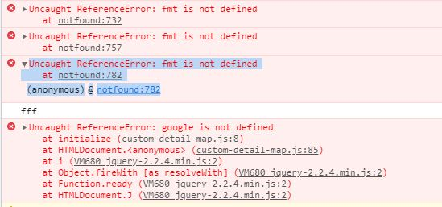
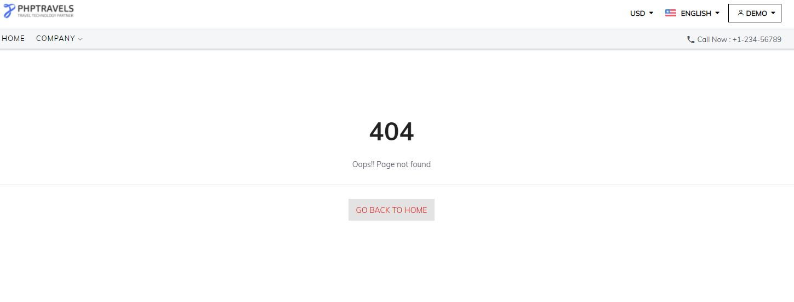
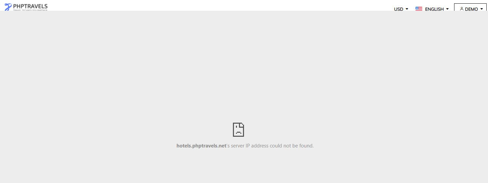

# Project Overview

Exploratory testing on https://www.phptravels.net

### NOTE

The search functionality doesn't work at all. Not sure if this is part of the challenge or maybe the site is not working at this moment or some breaking change are deployed in last few days.
The issues will be reported below because with broken Search functionality I cannot do any further testing.

## Issues

1. Search functionality returns 404 when you search by hotel 
    Steps to reproduce: 
    * Navigate to https://www.phptravels.net
    * Navigate to My Account -> Login
    * Enter correct password and username 
    * Navigate to home page 
    * Search for some hotel ( Example: type "Hotel" in the search box) 
    * Click on "Search" button 
    
    Actual Results: You will get 404 Not Found error 
    Expected Results: Hotel should be shown on the page (Expected results should be more detailed but at this moment I don't know what is expected) 
    
    Console Errors: 
    * https://www.phptravels.net/home/suggestions_v2/hotels?q=hote&_=1626729572861 -> Request is with status Cancalled
    * notfound:782 Uncaught ReferenceError: fmt is not defined
        at notfound:782
    (anonymous) @ notfound:782

    Screenshoots:  
   
   

2. Search functionality returns "IP Address could not be found" when you search by City 
    Steps to reproduce: 
    * Navigate to https://www.phptravels.net
    * Navigate to My Account -> Login
    * Enter correct password and username 
    * Navigate to home page 
    * Search for some city ( Example: type "New York" in the search box) 
    * Click on "Search" button 
    
    Actual Results: You will get a message that "IP Address could not e found 
    Expected Results: List of hotels for the given city should be shown (Expected results should be more detailed but at this moment I don't know what is expected) 
    
    NOTE: There are no console errors and no failed requests. This could be because of some IP address restrictions
    
    Screenshoots:  
    
    
